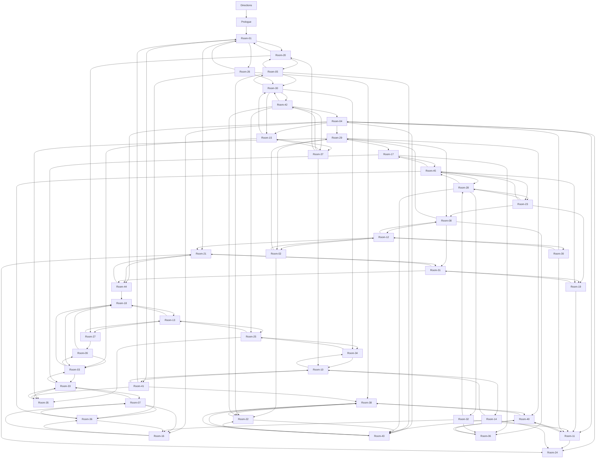

# Into the Abyss - Maze Navigation Map

This document contains the complete navigation structure of the "Into the Abyss" maze website at http://www.intotheabyss.net/

## Overview

The maze consists of 47 pages total:
- **Directions**: The entry point with rules and objective
- **Prologue**: Introduction to the maze
- **Rooms 1-45**: The main maze structure with interconnected rooms

Players navigate from the Directions page through the Prologue to Room-01, and must find their way to Room-45 (the center) and back to Room-01, ideally in 16 steps or fewer.

## Navigation Graph

## Key Observations

- **Entry Point**: Directions → Prologue → Room-01
- **Central Hub**: Room-45 is highly connected with 5 outgoing exits
- **Dead End**: Room-24 has no outgoing connections (though 2 rooms lead to it)
- **Highly Connected**: Room-04 has 7 different room exits
- **Cycles**: The maze contains many cyclical paths, allowing players to loop back to previously visited rooms
- **Low Connectivity**: Rooms 06, 17, 19, 24, 25, 35, and 36 have fewer than 3 exits

## Navigation Strategy

This graph structure creates an interesting puzzle where:
- Multiple paths can lead between the same rooms
- It's easy to get "lost" and end up revisiting rooms
- The shortest path from Room-01 to Room-45 and back requires careful navigation
- Clues in the artwork and text guide players toward the optimal path
